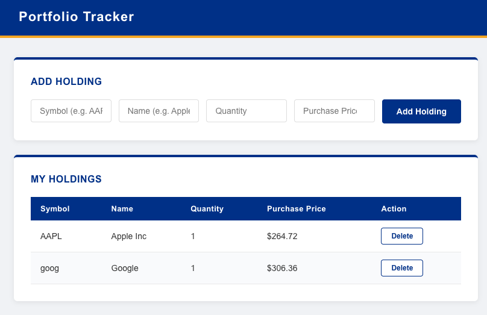
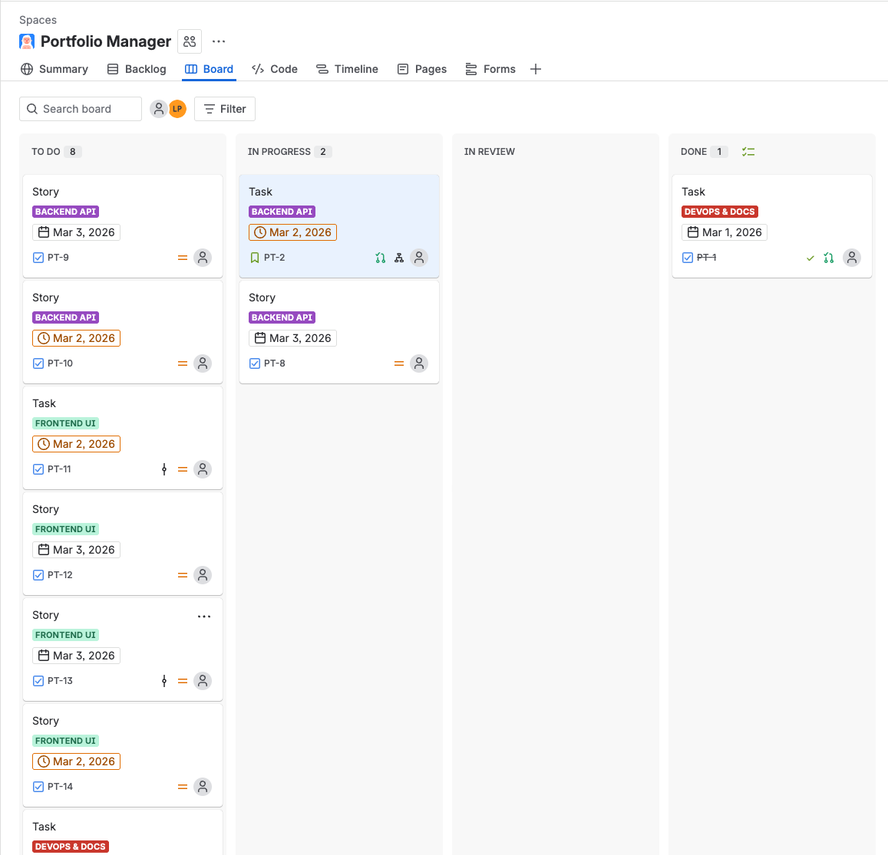
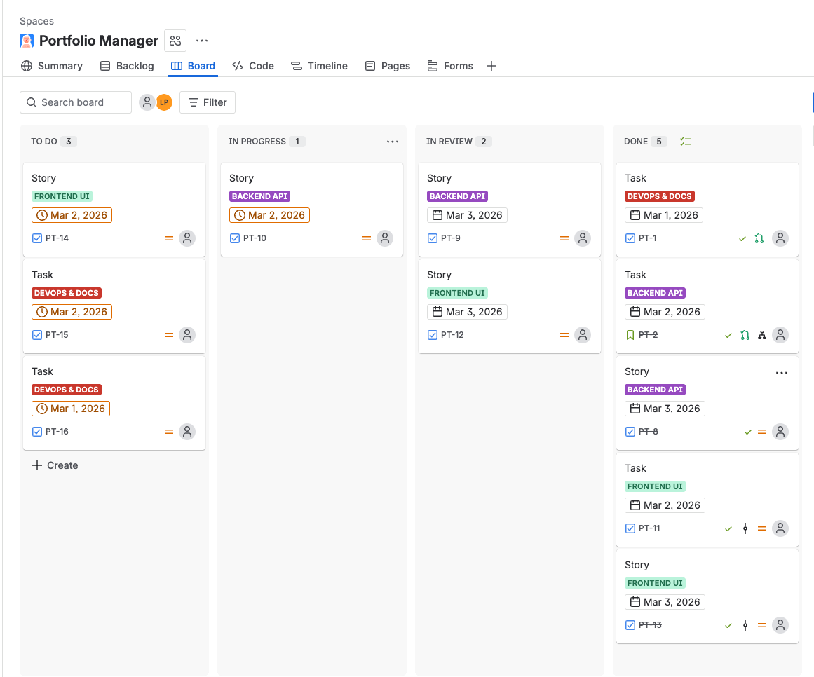
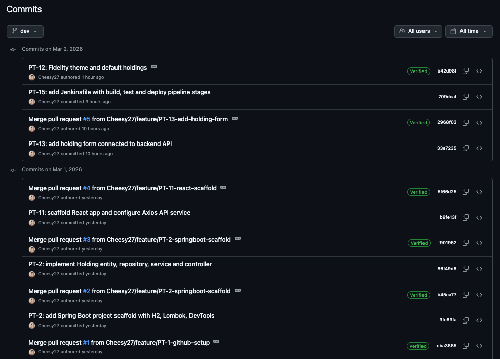
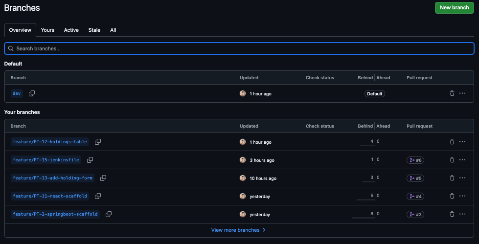
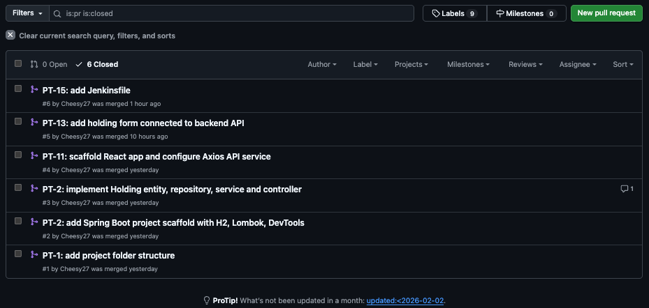

# Portfolio Tracker

A full-stack web application for tracking stock and fund holdings with live market prices. You can add holdings by entering a stock symbol and the app automatically fetches the current price from the market. Your holdings are displayed in a clean table where you can add or remove them at any time.

This project was built as a personal learning project to demonstrate full-stack development skills using the same tools and workflow used by professional software development teams.

---

## Screenshots

### Application



### Agile Workflow — Jira Sprint Board

**Sprint Kickoff — Day 1**



**Sprint in Progress — Mid Sprint**



### Git Workflow — GitHub

**Commit History**



**Feature Branches**



**Merged Pull Requests**



---

## How to Download and Run This Project

This section walks you through everything from scratch, including how to get the project files off GitHub onto your computer.

### What is GitHub?

GitHub is a website where developers store and share their code. Think of it like Google Drive but for code. When you "clone" a repository, you are downloading a copy of the project onto your computer so you can run it.

### Step 1: Install the required tools

Before anything else, make sure you have these installed on your computer.

**Git** — the tool that lets you download code from GitHub

- Download at: git-scm.com
- After installing, open a terminal and type `git --version` to confirm it worked

**Java 19** — the language the backend is written in

- Download at: adoptium.net
- After installing, type `java -version` to confirm it worked

**Maven** — the tool that builds and runs the Java backend

- Download at: maven.apache.org/download
- After installing, type `mvn -version` to confirm it worked

**Node.js** — the tool that runs the React frontend

- Download at: nodejs.org and download the LTS version
- After installing, type `node -version` to confirm it worked

### Step 2: Open a terminal

On Mac, press Command + Space, type Terminal and hit Enter.
On Windows, press the Windows key, type Command Prompt and hit Enter.

### Step 3: Download the project from GitHub

In your terminal, type this exactly and hit Enter:

```
git clone https://github.com/Cheesy27/portfolio-tracker.git
```

This downloads the entire project onto your computer. You will see a new folder called portfolio-tracker appear. Navigate into it:

```
cd portfolio-tracker
```

### Step 4: Add your Alpha Vantage API key

The app uses Alpha Vantage to fetch live stock prices. You need a free API key.

1. Go to alphavantage.co and click Get Free API Key
2. Fill in your details and copy the key they give you
3. Open the file `backend/src/main/resources/application.properties`
4. Find the line that says `alphavantage.api.key=` and paste your key after the equals sign

### Step 5: Start the backend

Open a terminal and run:

```
cd portfolio-tracker/backend
./mvnw spring-boot:run
```

On Windows use `mvnw.cmd spring-boot:run` instead.

Wait until you see "Started PortfolioTrackerApplication" in the terminal. Leave this terminal open.

### Step 6: Start the frontend

Open a second terminal and run:

```
cd portfolio-tracker/frontend
npm install
npm start
```

Your browser will open automatically at http://localhost:3000. Both terminals need to stay open at the same time for the app to work.

---

## How to Use the App

- Type a stock symbol in the Symbol field (for example AAPL for Apple, GOOG for Google)
- Click out of the field and the current market price will auto-fill in the Purchase Price field
- Fill in the Name and Quantity fields
- Click Add Holding to save it
- Your holding appears in the table below
- Click Delete on any row to remove it

---

## Tech Stack

**Backend**

- Java 19
- Spring Boot 4.0.3
- Spring Data JPA
- Hibernate
- H2 In-Memory Database
- Maven

**Frontend**

- React 18
- Axios
- CSS3

**External API**

- Alpha Vantage — real time stock price data

**DevOps and Workflow**

- Git with feature branching strategy
- GitHub for version control and pull requests
- Jira for sprint and ticket management
- Jenkinsfile for CI/CD pipeline definition

---

## Project Architecture

The backend is a Spring Boot REST API that handles all business logic and data persistence. It exposes three endpoints under /api/holdings for getting, adding, and deleting holdings, and one endpoint under /api/stock/{symbol} that fetches live prices from Alpha Vantage. Data is stored in an H2 in-memory database using JPA and Hibernate. A set of default Fidelity fund holdings are inserted automatically on startup via a data.sql script.

The frontend is a React application running on port 3000. It uses Axios to make HTTP requests to the Spring Boot backend on port 8080. The UI has two main components — an add holding form and a holdings table — both managed through React state.

CORS is configured on the backend to allow requests from the React frontend during local development.

---

## Project File Structure

```
portfolio-tracker/
├── Jenkinsfile
├── README.md
│
├── backend/
│   ├── pom.xml
│   └── src/
│       └── main/
│           ├── java/
│           │   └── com/fcproject/portfolio_tracker/
│           │       ├── PortfolioTrackerApplication.java
│           │       ├── controller/
│           │       │   ├── HoldingController.java
│           │       │   └── StockController.java
│           │       ├── model/
│           │       │   └── Holding.java
│           │       ├── repository/
│           │       │   └── HoldingRepository.java
│           │       └── service/
│           │           ├── HoldingService.java
│           │           └── StockService.java
│           └── resources/
│               ├── application.properties
│               └── data.sql
│
└── frontend/
    ├── package.json
    └── src/
        ├── App.js
        ├── App.css
        ├── index.js
        ├── api/
        │   └── holdingsApi.js
        └── components/
            ├── AddHoldingForm.jsx
            └── HoldingsList.jsx
```

---

## Key Concepts

**REST API design** — the backend follows REST conventions. GET retrieves data, POST creates new records, and DELETE removes them. Each endpoint returns the appropriate HTTP status code (200, 201, 204, 404).

**Spring Data JPA** — instead of writing raw SQL, the application uses JPA repositories that provide built-in database operations. HoldingRepository extends JpaRepository and gets save, findAll, and deleteById out of the box.

**Lombok** — the @Data annotation on the Holding entity auto-generates all getters, setters, and constructors at compile time, keeping the model class clean.

**Dependency Injection** — Spring Boot automatically injects dependencies through constructor injection. The controller receives the service, and the service receives the repository.

**React Hooks** — the frontend uses useState to manage component state and useEffect to fetch data from the backend when the component loads or when a new holding is added.

**External API Integration** — StockService calls Alpha Vantage's GLOBAL_QUOTE endpoint to retrieve the current market price for any stock symbol. The API key is stored on the backend so it is never exposed in frontend code.

**CI/CD Pipeline** — the Jenkinsfile defines a four-stage pipeline: checkout, build backend, run tests, and build frontend.

---

## Challenges and How I Solved Them

**Package naming and file structure in Spring Boot**
Early on I created the model and repository files in the wrong directory, which caused VSCode to flag them as non-project files. The fix was understanding that Spring Boot requires all source files to live under the correct package path inside src/main/java. Once I moved the files and updated the package declarations to match, the errors cleared up.

**data.sql running before the table existed**
When I added default holdings through a data.sql file, the application crashed on startup. The issue was that Spring Boot was trying to run the SQL insert statements before Hibernate had finished creating the holdings table. The fix was adding spring.jpa.defer-datasource-initialization=true to application.properties.

**CORS blocking frontend requests**
When I first connected the React frontend to the Spring Boot backend, all requests were being blocked. This was a CORS issue — the browser was preventing the React app on port 3000 from making requests to the backend on port 8080 because they are on different ports. The fix was adding @CrossOrigin(origins = "http://localhost:3000") to the controllers.

**Git branch tracking**
Early in the project I ran into an issue pushing a new branch where Git returned a refspec error. The cause was trying to push a branch that had no commits on it yet. The fix was creating an empty initial commit using git commit --allow-empty before pushing.

**Form data types causing a 500 error**
When submitting the add holding form, the backend returned a 500 Internal Server Error. The issue was that React was sending quantity and purchasePrice as strings instead of numbers. The fix was wrapping those values in parseFloat() before sending them to the backend.

---

## Agile Workflow

This project was built following a structured agile sprint using the same tools and conventions used by professional development teams.

**Jira** was used to plan and manage all work. Features were broken into epics, stories, and tasks before any code was written. Each ticket was assigned story points and tracked through four columns: To Do, In Progress, In Review, and Done.

**Git branching** followed a feature branch strategy. Every Jira ticket had a corresponding branch named after the ticket ID, for example feature/PT-10-delete-holdings. No code was committed directly to main or dev. All work went through a pull request.

**Sprint 1** delivered the full MVP — a working backend API, a connected React frontend, default data on startup, and a Jenkinsfile for CI/CD.

**Sprint 2** added live stock price integration via the Alpha Vantage API, inline form validation, and a responsive layout.

---

## CI/CD Pipeline

The Jenkinsfile at the root of the repository defines a declarative pipeline with four stages:

1. Checkout — pulls the latest code from the repository
2. Build Backend — compiles the Spring Boot project using Maven
3. Test — runs the backend test suite
4. Build Frontend — installs npm dependencies and builds the React production bundle

---

## API Reference

| Method | Endpoint            | Description                           |
| ------ | ------------------- | ------------------------------------- |
| GET    | /api/holdings       | Returns all holdings                  |
| POST   | /api/holdings       | Creates a new holding                 |
| DELETE | /api/holdings/{id}  | Deletes a holding by ID               |
| GET    | /api/stock/{symbol} | Returns live price for a stock symbol |

### Example POST request body

```json
{
  "symbol": "AAPL",
  "name": "Apple Inc",
  "quantity": 10,
  "purchasePrice": 264.72
}
```
